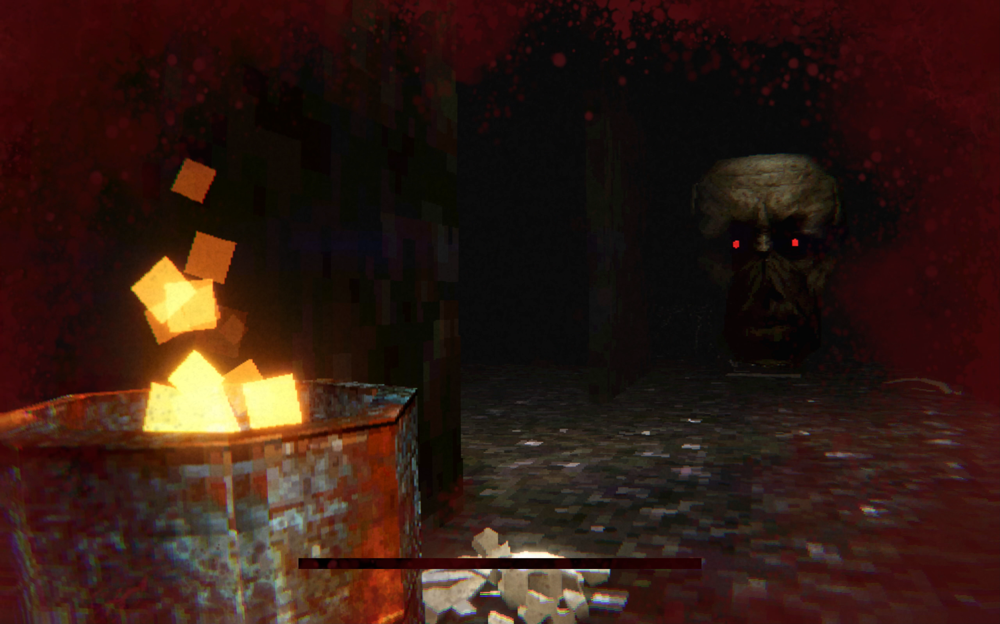
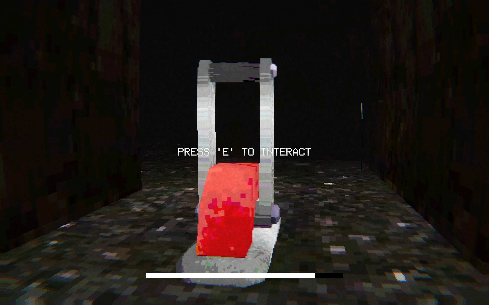
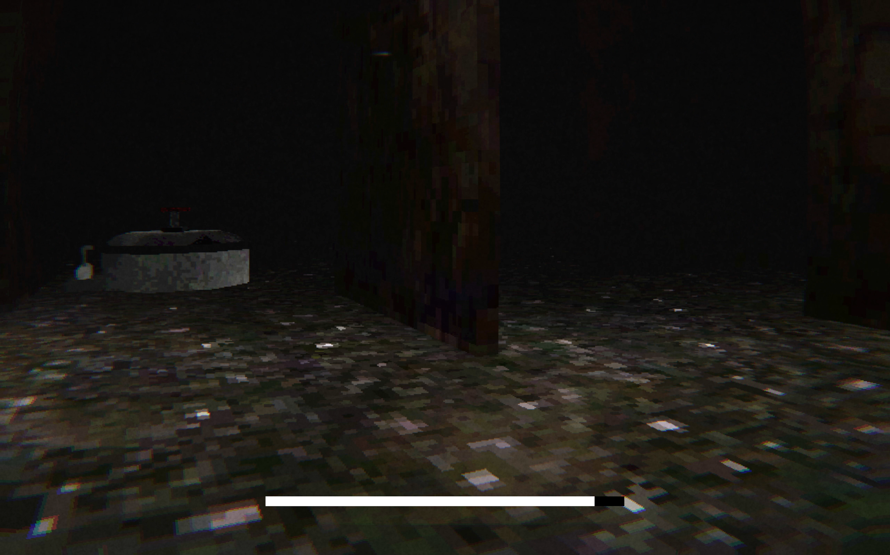

# No Snake Maze

A retro-style, first-person horror game developed in Unity. The player is trapped in a procedurally generated maze and must activate 5 levers to unlock an escape hatch—all while being hunted by a grotesque, human-headed serpent.

## Gameplay Preview

*screenshots*

## Key Technical Features

* **Procedural Maze Generation:** Algorithm-driven level design that creates a unique, randomized labyrinth layout for every playthrough, ensuring endless replayability.
* **Enemy AI & Pathfinding:** Implementation of a relentless pursuit AI for the monstrous entity, utilizing Unity's NavMesh to navigate the complex, procedurally generated environment.
* **Interaction & State Management:** Raycast-based interaction system for pulling levers, tracking the main objectives, and triggering the final escape hatch once conditions are met.
* **Retro PS1 Aesthetics:** Custom visual style utilizing low-poly models, pixelated textures, shaders and post-processing effects (CRT/VHS filters) to recreate a nostalgic horror atmosphere.
* **Complete Audio Integration:** Full spatial sound design, including ambient background noise, terrifying monster cues, and interaction SFX to build tension.
* **Game Flow Control:** Fully functional Main Menu, seamless scene transitions, and complete win/loss state management.

## Built With

* **Unity Engine:** Core game loop, 3D rendering, NavMesh, and UI.
* **C# Scripting:** Procedural generation algorithms, AI logic, interaction events, and game state control.

## Project Structure

* `/Assets/Scripts:` C# logic for maze generation, enemy AI, and player interactions.
* `/Assets/Prefabs:` Reusable objects for maze modules, levers, and the enemy entity.
* `/Assets/Audio:` Background music and sound effects.
* `/Media:` Project documentation assets.

## How to Run

1. Clone this repository.
2. Open the project in Unity (Version 6000.0.28f1).
3. Load the `Main Menu` scene located in the `Assets/Scenes` folder.
4. Press Play to start the game.

## Author
* **Szymon Marczuk** - [GitHub Profile](https://github.com/MarczukMobbyn)
